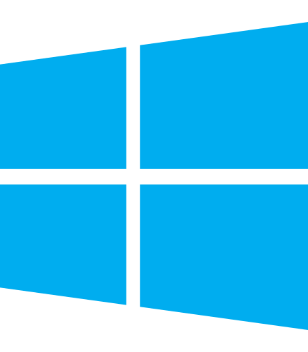
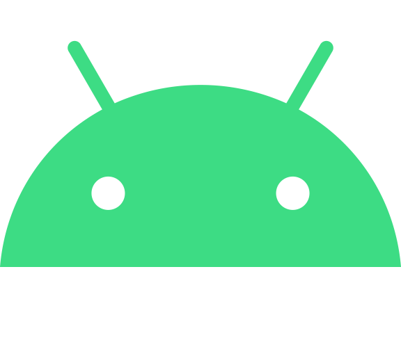
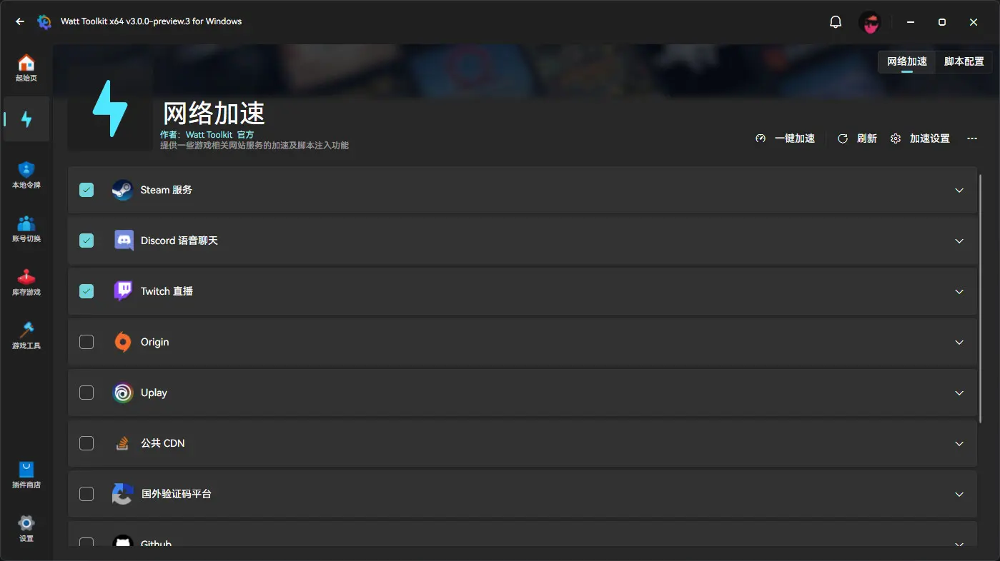

<h1 align="center">Watt Toolkit 🧰 (Former name Steam++)</h1>

English | [简体中文](./README.md)

"Watt Toolkit" is an open source cross-platform multi-purpose game toolkit, most of its features require you to download and install Steam to use it.

## 🚀 Download Channels
- 
- [Official WebSite](https://steampp.net)
- [GitHub Releases](https://github.com/BeyondDimension/SteamTools/releases)
- [Gitee Releases](https://gitee.com/rmbgame/SteamTools/releases)
- [Arch User Repository](https://aur.archlinux.org/packages/watt-toolkit-bin)(Current release build)
- [Arch User Repository dev](https://aur.archlinux.org/packages/watt-toolkit-git)(Pull the latest source code build, maybe the build will fail)

## ⬇️ [Download Guide](./doc/download-guide.en.md)
See details [./doc/download-guide.en.md](./doc/download-guide.en.md)  

## ✨ Functions
1. Account Switch   
	- Switch between Steam accounts that are already logged in on the current PC with one click, and manage features such as sorting your home shared library.
2. Inventory Management   
	- Lets you manage your Steam game inventory directly, not only by downloading older Steam games, but also by managing Steam game achievements directly, supporting unlocked achievements and unlocked achievements.
3. Local Authentication     
	- Let your cell phone token unified save in the computer, currently only support Steam token, later will develop support more token types with cloud synchronization token.
4. ArchiSteamFarm     
	- Integration with [ArchiSteamFarm](https://github.com/JustArchiNET/ArchiSteamFarm) provides functions such as hanging and dropping Steam Collectible Cards within the app.
5. Game Tools 
	- Force game windows to use borderless windowing

## 🖥 Supported Operating Systems
- Windows 11
- Windows 10 version 1809(OS internal version 17763) or higher is required
- macOS 10.15 or higher is required
- Ubuntu 20.04 or higher is required
- Debian 11 or higher is required
- Fedora 37 or higher is required
- Deepin(UOS) 20 or higher is required
- ~~iOS 11 or higher is required~~(In development…)
- Android 5.0(API 21) or higher is required

## 🧩 Screenshots

 
 

## 🌏 Roadmap
Read what we [milestones](https://github.com/BeyondDimension/SteamTools/milestones), and feel free to ask questions.

## ⌨️ Development Environment
[Visual Studio 2022](https://visualstudio.microsoft.com/vs)  
[Visual Studio 2022 for Mac](https://visualstudio.microsoft.com/vs/mac)  
[JetBrains Rider](https://www.jetbrains.com/rider)  
[Visual Studio Code](https://code.visualstudio.com)  
[OpenJDK 17](https://learn.microsoft.com/en-us/java/openjdk/download#openjdk-17)  
[Android Studio Electric Eel Or Higher](https://developer.android.com/studio)  
[Xcode 14 Or Higher](https://developer.apple.com/xcode)  

## 🏗️ Project Structure
See details&nbsp;&nbsp;[./src/README.md](./src/README.md) 

## 📄 Open Source Library
See details&nbsp;&nbsp;[./doc/open-source-library.md](./doc/open-source-library.md)  
