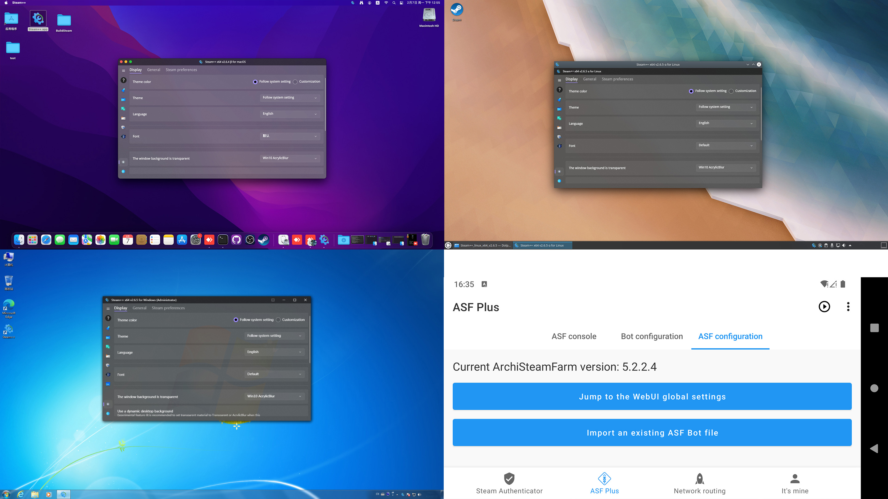

<h1 align="center">Steam++ Tools 🧰</h1>

「Steam++」is a toolkit that contains a variety of Steam tools, most of which require you to download and install Steam in order to use them.

English | [简体中文](./README.md)

## 🚀 Download channel
- [GitHub Releases](https://github.com/SteamTools-Team/SteamTools/releases)
- [Gitee Releases](https://gitee.com/rmbgame/SteamTools/releases)
- [Official WebSite](https://steampp.net)
- [Microsoft Store](https://www.microsoft.com/store/apps/9MTCFHS560NG)

## ✨ Functions
1. Local reverse proxy for Steam's community webpage to enable normal access in **the Chinese Mainland, Mainland of China**
2. Quickly switch the Steam account that the current PC has remembered to log into
	- This feature is to read the local user login records stored under the Steam path to directly display the operation, you can switch between multiple accounts without re-entering passwords and tokens.
3. Achievement stat modifications for Steam games
	- Function reference SteamAchievementManager for secondary development, modified the game list loading and operation ease of use. 
4. Steam Local Two-Step Authenticator
    - The function reference [WinAuth](https://github.com/winauth/winauth) is developed to enable you to view your token without launching the mobile version of Steam App, similar function software are [WinAuth](https://github.com/winauth/winauth), [SteamDesktopAuthenticator](https://github.com/Jessecar96/SteamDesktopAuthenticator).
5. Some game tools
	- Currently there is a forced game borderless windowing, CSGO fix mistake VAC shield.

<!--Prerequisites Microsoft Visual C++ 2015-2019 Redistributable [64 bit](https://aka.ms/vs/16/release/vc_redist.x64.exe) / [32 bit](https://aka.ms/vs/16/release/vc_redist.x86.exe)-->
## 🖥 Supported Operating Systems
### Windows

OS                                    | Version                 | Architectures   | Lifecycle
--------------------------------------|-------------------------|-----------------|----------
[Windows Client][Windows-client]      | 7 SP1(**\***), 8.1      | x64        | [Windows][Windows-lifecycle]
[Windows 10 Client][Windows-client]   | Version 1607+           | x64 | [Windows][Windows-lifecycle]
[Windows Server][Windows-Server]      | 2012+                | x64        | [Windows Server][Windows-Server-lifecycle]

**\*** Windows 7 SP1 is supported with KB3063858 [64 bit](https://www.microsoft.com/download/details.aspx?id=47442) installed.

[Windows-client]: https://www.microsoft.com/windows/
[Windows-lifecycle]: https://support.microsoft.com/help/13853/windows-lifecycle-fact-sheet
[win-client-docker]: https://hub.docker.com/_/microsoft-windows
[Windows-Server-lifecycle]: https://docs.microsoft.com/windows-server/get-started/windows-server-release-info
[Nano-Server]: https://docs.microsoft.com/windows-server/get-started/getting-started-with-nano-server
[Windows-Server]: https://docs.microsoft.com/windows-server/

### Linux

OS                                    | Version               | Architectures     | Lifecycle
--------------------------------------|-----------------------|-------------------|----------
[Alpine Linux][Alpine]                | 3.13+                 | x64, Arm64, Arm32 | [Alpine][Alpine-lifecycle]
[CentOS][CentOS]                      | 7+                    | x64               | [CentOS][CentOS-lifecycle]
[Debian][Debian]                      | 10+                   | x64, Arm64, Arm32 | [Debian][Debian-lifecycle]
[Fedora][Fedora]                      | 33+                   | x64               | [Fedora][Fedora-lifecycle]
[openSUSE][OpenSUSE]                  | 15+                   | x64               | [OpenSUSE][OpenSUSE-lifecycle]
[Red Hat Enterprise Linux][RHEL]      | 7+                    | x64, Arm64        | [Red Hat][RHEL-lifecycle]
[SUSE Enterprise Linux (SLES)][SLES]  | 12 SP2+               | x64               | [SUSE][SLES-lifecycle]
[Ubuntu][Ubuntu]                      | 16.04, 18.04, 20.04+  | x64, Arm64, Arm32 | [Ubuntu][Ubuntu-lifecycle]
[Deepin / UOS][Deepin]                      | 20+                   | x64 | [Deepin][Deepin-lifecycle]

[Alpine]: https://alpinelinux.org/
[Alpine-lifecycle]: https://wiki.alpinelinux.org/wiki/Alpine_Linux:Releases
[CentOS]: https://www.centos.org/
[CentOS-lifecycle]:https://wiki.centos.org/FAQ/General
[CentOS-docker]: https://hub.docker.com/_/centos
[CentOS-pm]: https://docs.microsoft.com/dotnet/core/install/linux-package-manager-centos8
[Debian]: https://www.debian.org/
[Debian-lifecycle]: https://wiki.debian.org/DebianReleases
[Debian-pm]: https://docs.microsoft.com/dotnet/core/install/linux-package-manager-debian10
[Fedora]: https://getfedora.org/
[Fedora-lifecycle]: https://fedoraproject.org/wiki/End_of_life
[Fedora-docker]: https://hub.docker.com/_/fedora
[Fedora-msft-pm]: https://docs.microsoft.com/dotnet/core/install/linux-package-manager-fedora32
[Fedora-pm]: https://fedoraproject.org/wiki/DotNet
[OpenSUSE]: https://opensuse.org/
[OpenSUSE-lifecycle]: https://en.opensuse.org/Lifetime
[OpenSUSE-docker]: https://hub.docker.com/r/opensuse/leap
[OpenSUSE-pm]: https://docs.microsoft.com/dotnet/core/install/linux-package-manager-opensuse15
[RHEL]: https://www.redhat.com/en/technologies/linux-platforms/enterprise-linux
[RHEL-lifecycle]: https://access.redhat.com/support/policy/updates/errata/
[RHEL-msft-pm]: https://docs.microsoft.com/dotnet/core/install/linux-package-manager-rhel8
[RHEL-pm]: https://access.redhat.com/documentation/en-us/red_hat_enterprise_linux/8/html/developing_.net_applications_in_rhel_8/using-net-core-on-rhel_gsg#installing-net-core_gsg
[SLES]: https://www.suse.com/products/server/
[SLES-lifecycle]: https://www.suse.com/lifecycle/
[SLES-pm]: https://docs.microsoft.com/dotnet/core/install/linux-package-manager-sles15
[Ubuntu]: https://ubuntu.com/
[Ubuntu-lifecycle]: https://wiki.ubuntu.com/Releases
[Ubuntu-pm]: https://docs.microsoft.com/dotnet/core/install/linux-package-manager-ubuntu-2004
[Deepin]: https://www.deepin.org/
[Deepin-lifecycle]: https://www.deepin.org/release-notes

### macOS

OS                            | Version                   | Architectures     |
------------------------------|---------------------------|-------------------|
[macOS][macOS]                | 10.14+                    | x64        |

[macOS]: https://support.apple.com/macos

### Android

OS                            | Version                 | Architectures     |
------------------------------|-------------------------|-------------------|
[Android][Android]            | 5.0(API 21)+                 | [Arm32](https://developer.android.google.cn/ndk/guides/abis?hl=zh_cn#v7a), [Arm64](https://developer.android.google.cn/ndk/guides/abis?hl=zh_cn#arm64-v8a) |

[Android]: https://support.google.com/android

### iOS / iPadOS

OS                            | Version                 | Architectures     |
------------------------------|-------------------------|-------------------|
[iOS][iOS]                    | 10.0+                   | x64, Arm32, Arm64 |

[iOS]: https://support.apple.com/ios

## ⛔ Unsupported Operating System
- Windows 8
	- [Due to Microsoft's official support for the product has ended](https://docs.microsoft.com/lifecycle/products/windows-8), so this program cannot run on this operating system, [It is recommended to upgrade to Windows 8.1](https://support.microsoft.com/windows/update-to-windows-8-1-from-windows-8-17fc54a7-a465-6b5a-c1a0-34140afd0669)
- Windows Server 2008 R2 SP1
	- Only version 1.x is available, 2.x is not supported at first, and it is recommended to upgrade to a higher version
- Windows Server / Linux version without desktop GUI

## 🌏 Roadmap
Read what we [milestones](https://github.com/SteamTools-Team/SteamTools/milestones), and feel free to ask questions.

## ⌨️ Development Environment
[Visual Studio 2019 Version 16.11 Or Higher](https://visualstudio.microsoft.com/vs/) Or [JetBrains Rider](https://www.jetbrains.com/rider/) Or ~~[Visual Studio for Mac](https://visualstudio.microsoft.com/vs/mac/)~~ Or ~~[Visual Studio Code](https://code.visualstudio.com/)~~
- Supported Operating Systems
	- [Windows 10 Version 2004 Or Higher: Home, Professional, Education, and Enterprise (LTSC and S are not supported)](https://docs.microsoft.com/en-us/visualstudio/releases/2019/system-requirements)
	- [macOS 10.14 Mojave Or Higher](https://docs.microsoft.com/en-us/visualstudio/productinfo/vs2019-system-requirements-mac)
- Workload
	- Web and Cloud
		- ASP.NET and Web Development
	- Desktop and Mobile Applications
		- .NET Desktop Development
		- UWP Development
		- Mobile Development using .Net
	- Other Toolsets
		- .NET Core Cross Platform Development
- Single Component
	- GitHub Extension for Visual Studio
	- Windows 10 SDK (10.0.19041.0)
- [Visual Studio Marketplace](https://marketplace.visualstudio.com/)
	- [Avalonia for Visual Studio](https://marketplace.visualstudio.com/items?itemName=AvaloniaTeam.AvaloniaforVisualStudio)
	- [NUnit VS Templates](https://marketplace.visualstudio.com/items?itemName=NUnitDevelopers.NUnitTemplatesforVisualStudio)

[Android Studio 2020.3.1 Or Higher](https://developer.android.com/studio/)  
[Xcode 13 Or Higher](https://developer.apple.com/xcode/)

## 📄 Thanks to the following Open Source Projects
* [Newtonsoft.Json](https://github.com/JamesNK/Newtonsoft.Json)
* [MetroRadiance](https://github.com/Grabacr07/MetroRadiance)
* [MetroTrilithon](https://github.com/Grabacr07/MetroTrilithon)
* [Livet](https://github.com/runceel/Livet)
* [StatefulModel](https://github.com/ugaya40/StatefulModel)
* [Hardcodet.NotifyIcon](https://github.com/HavenDV/Hardcodet.NotifyIcon.Wpf.NetCore)
* [System.Reactive](https://github.com/dotnet/reactive)
* [Titanium-Web-Proxy](https://github.com/justcoding121/Titanium-Web-Proxy)
* [BrotliSharpLib](https://github.com/master131/BrotliSharpLib)
* [Portable.BouncyCastle](https://github.com/novotnyllc/bc-csharp)
* [Ninject](https://github.com/ninject/Ninject)
* [log4net](https://github.com/apache/logging-log4net)
* [SteamDB-API](https://github.com/SteamDB-API/api)
* [SteamAchievementManager](https://github.com/gibbed/SteamAchievementManager)
* [ArchiSteamFarm](https://github.com/JustArchiNET/ArchiSteamFarm)
* [Steam4NET](https://github.com/SteamRE/Steam4NET)
* [WinAuth](https://github.com/winauth/winauth)
* [SteamDesktopAuthenticator](https://github.com/Jessecar96/SteamDesktopAuthenticator)
* [Gameloop.Vdf](https://github.com/shravan2x/Gameloop.Vdf)
* [DnsClient.NET](https://github.com/MichaCo/DnsClient.NET)
* [Costura.Fody](https://github.com/Fody/Costura)
* [MessagePack-CSharp](https://github.com/neuecc/MessagePack-CSharp)
* [Nito.Comparers](https://github.com/StephenCleary/Comparers)
* [Crc32.NET](https://github.com/force-net/Crc32.NET)
* [gfoidl.Base64](https://github.com/gfoidl/Base64)
* [sqlite-net-pcl](https://github.com/praeclarum/sqlite-net)
* [Polly](https://github.com/App-vNext/Polly)
* [TaskScheduler](https://github.com/dahall/taskscheduler)
* [SharpZipLib](https://github.com/icsharpcode/SharpZipLib)
* [SevenZipSharp](https://github.com/squid-box/SevenZipSharp)
* [Depressurizer](https://github.com/Depressurizer/Depressurizer)
* [NLog](https://github.com/nlog/NLog)
* [NUnit](https://github.com/nunit/nunit)
* [ReactiveUI](https://github.com/reactiveui/reactiveui)
* [MessageBox.Avalonia](https://github.com/AvaloniaUtils/MessageBox.Avalonia)
* [AvaloniaUI](https://github.com/AvaloniaUI/Avalonia)
* [AvaloniaGif](https://github.com/jmacato/AvaloniaGif)
* [Avalonia XAML Behaviors](https://github.com/wieslawsoltes/AvaloniaBehaviors)
* [FluentAvalonia](https://github.com/amwx/FluentAvalonia)
* [APNG.NET](https://github.com/jz5/APNG.NET)
* [Moq](https://github.com/moq/moq4)
* [NPOI](https://github.com/nissl-lab/npoi)
* [Fleck](https://github.com/statianzo/Fleck)
* [Swashbuckle.AspNetCore](https://github.com/domaindrivendev/Swashbuckle.AspNetCore)
* [AspNet.Security.OpenId.Providers](https://github.com/aspnet-contrib/AspNet.Security.OpenId.Providers)
* [AspNet.Security.OAuth.Providers](https://github.com/aspnet-contrib/AspNet.Security.OAuth.Providers)
* [ZXing.Net](https://github.com/micjahn/ZXing.Net)
* [QRCoder](https://github.com/codebude/QRCoder)
* [React](https://github.com/facebook/react)
* [Ant Design](https://github.com/ant-design/ant-design)
* [Ant Design Blazor](https://github.com/ant-design-blazor/ant-design-blazor)
* [Toast messages for Xamarin.iOS](https://github.com/andrius-k/Toast)
* [Visual Studio App Center SDK for .NET](https://github.com/microsoft/appcenter-sdk-dotnet)
* [AppCenter-XMac](https://github.com/nor0x/AppCenter-XMac)
* [MSBuild.Sdk.Extras](https://github.com/novotnyllc/MSBuildSdkExtras)
* [Xamarin.Essentials](https://github.com/xamarin/essentials)
* [Open Source Components for Xamarin](https://github.com/xamarin/XamarinComponents)
* [Google Play Services / Firebase / ML Kit for Xamarin.Android](https://github.com/xamarin/GooglePlayServicesComponents)
* [Picasso](https://github.com/square/picasso)
* [OkHttp](https://github.com/square/okhttp)
* [Material Components for Android](https://github.com/material-components/material-components-android)
* [AndroidX for Xamarin.Android](https://github.com/xamarin/AndroidX)
* [Android Jetpack](https://github.com/androidx/androidx)
* [ConstraintLayout](https://github.com/androidx/constraintlayout)
* [MSAL.NET](https://github.com/AzureAD/microsoft-authentication-library-for-dotnet)
* [Entity Framework Core](https://github.com/dotnet/efcore)
* [ASP.NET Core](https://github.com/dotnet/aspnetcore)
* [Windows Forms](https://github.com/dotnet/winforms)
* [Windows Presentation Foundation (WPF)](https://github.com/dotnet/wpf)
* [C#/WinRT](https://github.com/microsoft/CsWinRT)
* [command-line-api](https://github.com/dotnet/command-line-api)
* [.NET Runtime](https://github.com/dotnet/runtime)
* [Fluent UI System Icons](https://github.com/microsoft/fluentui-system-icons)
* [Material design icons](https://github.com/google/material-design-icons)
