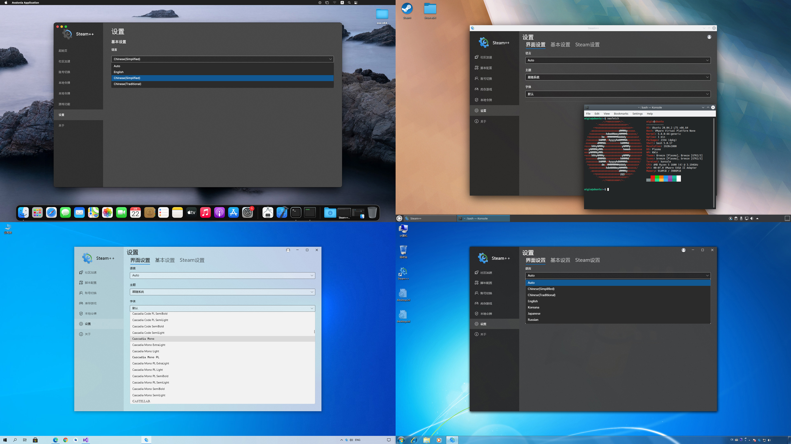

<h1 align="center">Steam++ 工具箱 🧰</h1>

「Steam++」是一个包含多种Steam工具功能的工具箱，此工具的大部分功能都是需要您下载安装Steam才能使用。

[English](./README.en.md) | 简体中文

## ✨ 功能
1. 反代 Steam 的社区网页使其能正常访问
	- 功能类似羽翼城大佬的 [steamcommunity_302](https://www.dogfight360.com/blog/686/)
	- 使用 [Titanium-Web-Proxy](https://github.com/justcoding121/Titanium-Web-Proxy) 开源项目进行本地反代，使国内用户可以正常访问 Steam 社区页
	- 相比 **302工具** 具有更快的启动速度，以及支持简单的脚本注入（还顺便支持了Pixiv、Discord、Twitch等网站的反代支持）
2. 快速切换当前设备已记住登陆的 Steam 账号
	- 该功能是读取 Steam 路径下存储的本地用户登录记录直接展示操作，可以多账号切换无需重新输入密码和令牌
3. Steam游戏的成就统计管理功能
	- 功能参考 [SteamAchievementManager](https://github.com/gibbed/SteamAchievementManager) 进行二次开发，修改了游戏列表的加载和操作易用性
4. Steam本地两步身份验证器
	- 功能参考 [WinAuth](https://github.com/winauth/winauth) 开发，可以使您不用启动移动版 Steam App 也能查看您的令牌
	- 本地令牌交易市场报价确认
	- 功能类似的软件例如：
		- [WinAuth](https://github.com/winauth/winauth)
		- [SteamDesktopAuthenticator](https://github.com/Jessecar96/SteamDesktopAuthenticator)
5. 其他游戏工具
	- 目前已有强制游戏无边框窗口化，CSGO 修复 VAC 误屏蔽

<!--发布配置SelfContained=true时会自动打包VC++相关程序集-->
<!--先决条件 Microsoft Visual C++ 2015-2019 Redistributable [64 位](https://aka.ms/vs/16/release/vc_redist.x64.exe) / [32 位](https://aka.ms/vs/16/release/vc_redist.x86.exe)-->
## 🖥 系统要求
- 桌面端(仅支持 X64 和 ARM64)
	- Windows 10 1607+ / Windows Server 版本 1903+ / Windows Server 2019 / Windows Server 2016
	- Windows 8.1 / Windows Server 2012 R2
	- Windows 7 SP1 [ESU](https://docs.microsoft.com/zh-cn/troubleshoot/windows-client/windows-7-eos-faq/windows-7-extended-security-updates-faq)
		- 先决条件
		- KB3063858 [64 位](https://www.microsoft.com/zh-cn/download/details.aspx?id=47442) / [32 位](https://www.microsoft.com/zh-cn/download/details.aspx?id=47409)
	- macOS 10.14 Mojave 或更高版本
	- Linux 发行版
		- Arch Linux
		- Alpine Linux 3.13+
		- CentOS 7+
		- Debian 10+
		- Deepin 20.1 / UOS 20
		- Fedora 32+
		- Linux Mint 18+
		- openSUSE 15+
		- Red Hat Enterprise Linux 7+
		- SUSE Enterprise Linux (SLES) 12 SP2+
		- Ubuntu 16.04, 18.04, 20.04+
- 移动端
	- Android 5.0/API 21+ (仅支持 [arm64-v8a](https://developer.android.google.cn/ndk/guides/abis?hl=zh_cn#arm64-v8a) 和 [armeabiv-v7a](https://developer.android.google.cn/ndk/guides/abis?hl=zh_cn#v7a))
	- iOS 10.0+ (仅支持 ARM64)

## ⛔ 不受支持的操作系统
- Windows 8
	- [由于微软官方对该产品的支持已结束](https://docs.microsoft.com/zh-cn/lifecycle/products/windows-8)，故本程序无法在此操作系统上运行，[建议升级到 Windows 8.1](https://support.microsoft.com/zh-cn/windows/%E4%BB%8E-windows-8-%E6%9B%B4%E6%96%B0%E5%88%B0-windows-8-1-17fc54a7-a465-6b5a-c1a0-34140afd0669)
- Windows Server 2012 / 2008 R2 SP1
	- 仅可使用 1.X 版本，2.X 开始不受支持，建议升级到 **Windows Server 2012 R2** 或更高版本
- 无桌面 GUI 的 Windows Server / Linux 版本

## 🌏 路线图
查看这个 [milestones](https://github.com/SteamTools-Team/SteamTools/milestones) 来了解我们下一步的开发计划，并随时提出问题。

## ⌨️ 开发环境
[Visual Studio 2019 版本 16.10 或更高版本](https://visualstudio.microsoft.com/zh-hans/vs/) 或 [JetBrains Rider](https://www.jetbrains.com/rider/) 或 ~~[Visual Studio for Mac](https://visualstudio.microsoft.com/zh-hans/vs/mac/)~~ 或 ~~[Visual Studio Code](https://code.visualstudio.com/)~~
- 系统要求
	- [Windows 10 版本 2004 或更高版本：家庭版、专业版、教育版和企业版（不支持 LTSC 和 Windows 10 S，在较早的操作系统上可能不受支持）](https://docs.microsoft.com/zh-cn/visualstudio/releases/2019/system-requirements)
	- [macOS 10.13 High Sierra 或更高版本](https://docs.microsoft.com/zh-cn/visualstudio/productinfo/vs2019-system-requirements-mac)
- 工作负载
	- Web 和云
		- ASP.NET 和 Web 开发
	- 桌面应用和移动应用
		- .NET 桌面开发
		- 通用 Windows 平台开发
		- 使用 .NET 的移动开发
	- 其他工具集
		- .NET Core 跨平台开发
- 单个组件
	- GitHub Extension for Visual Studio
	- Windows 10 SDK (10.0.19041.0)
- [Visual Studio Marketplace](https://marketplace.visualstudio.com/)
	- [Avalonia for Visual Studio](https://marketplace.visualstudio.com/items?itemName=AvaloniaTeam.AvaloniaforVisualStudio)
	- [NUnit VS Templates](https://marketplace.visualstudio.com/items?itemName=NUnitDevelopers.NUnitTemplatesforVisualStudio)

[Android Studio 4.2+](https://developer.android.google.cn/studio/)  
[Xcode 13](https://developer.apple.com/xcode/)

## 🏗️ [项目结构](./src/README.md)

<!--👇图标如果发生更改，还需更改 Tools.OpenSourceLibraryList(Program.OpenSourceLibraryListEmoji) -->
## 📄 感谢以下开源项目
* [Newtonsoft.Json](https://github.com/JamesNK/Newtonsoft.Json)
* [MetroRadiance](https://github.com/Grabacr07/MetroRadiance)
* [MetroTrilithon](https://github.com/Grabacr07/MetroTrilithon)
* [Livet](https://github.com/runceel/Livet)
* [StatefulModel](https://github.com/ugaya40/StatefulModel)
* [Hardcodet.NotifyIcon](https://github.com/HavenDV/Hardcodet.NotifyIcon.Wpf.NetCore)
* [System.Reactive](https://github.com/dotnet/reactive)
* [Titanium-Web-Proxy](https://github.com/justcoding121/Titanium-Web-Proxy)
* [BrotliSharpLib](https://github.com/master131/BrotliSharpLib)
* [Portable.BouncyCastle](https://github.com/novotnyllc/bc-csharp)
* [Ninject](https://github.com/ninject/Ninject)
* [log4net](https://github.com/apache/logging-log4net)
* [SteamDB-API](https://github.com/SteamDB-API/api)
* [SteamAchievementManager](https://github.com/gibbed/SteamAchievementManager)
* [ArchiSteamFarm](https://github.com/JustArchiNET/ArchiSteamFarm)
* [Steam4NET](https://github.com/SteamRE/Steam4NET)
* [WinAuth](https://github.com/winauth/winauth)
* [SteamDesktopAuthenticator](https://github.com/Jessecar96/SteamDesktopAuthenticator)
* [Gameloop.Vdf](https://github.com/shravan2x/Gameloop.Vdf)
* [DnsClient.NET](https://github.com/MichaCo/DnsClient.NET)
* [Costura.Fody](https://github.com/Fody/Costura)
* [MessagePack-CSharp](https://github.com/neuecc/MessagePack-CSharp)
* [Nito.Comparers](https://github.com/StephenCleary/Comparers)
* [Crc32.NET](https://github.com/force-net/Crc32.NET)
* [gfoidl.Base64](https://github.com/gfoidl/Base64)
* [sqlite-net-pcl](https://github.com/praeclarum/sqlite-net)
* [Polly](https://github.com/App-vNext/Polly)
* [TaskScheduler](https://github.com/dahall/taskscheduler)
* [SharpZipLib](https://github.com/icsharpcode/SharpZipLib)
* [LibVLCSharp](https://github.com/videolan/libvlcsharp)
* [Depressurizer](https://github.com/Depressurizer/Depressurizer)
* [NLog](https://github.com/nlog/NLog)
* [NUnit](https://github.com/nunit/nunit)
* [ReactiveUI](https://github.com/reactiveui/reactiveui)
* [MessageBox.Avalonia](https://github.com/AvaloniaUtils/MessageBox.Avalonia)
* [AvaloniaUI](https://github.com/AvaloniaUI/Avalonia)
* [AvaloniaGif](https://github.com/jmacato/AvaloniaGif)
* [Avalonia XAML Behaviors](https://github.com/wieslawsoltes/AvaloniaBehaviors)
* [APNG.NET](https://github.com/jz5/APNG.NET)
* [Chromium Embedded Framework (CEF)](https://github.com/chromiumembedded/cef)
* [Moq](https://github.com/moq/moq4)
* [NPOI](https://github.com/nissl-lab/npoi)
* [Swashbuckle.AspNetCore](https://github.com/domaindrivendev/Swashbuckle.AspNetCore)
* [AspNet.Security.OpenId.Providers](https://github.com/aspnet-contrib/AspNet.Security.OpenId.Providers)
* [AspNet.Security.OAuth.Providers](https://github.com/aspnet-contrib/AspNet.Security.OAuth.Providers)
* [CefNet](https://github.com/CefNet/CefNet)
* [CefSharp](https://github.com/cefsharp/CefSharp)
* [React](https://github.com/facebook/react)
* [Ant Design](https://github.com/ant-design/ant-design)
* [Ant Design Blazor](https://github.com/ant-design-blazor/ant-design-blazor)
* [Toast messages for Xamarin.iOS](https://github.com/andrius-k/Toast)
* [Floating Action Button Speed Dial](https://github.com/leinardi/FloatingActionButtonSpeedDial)
* [Visual Studio App Center SDK for .NET](https://github.com/microsoft/appcenter-sdk-dotnet)
* [AppCenter-XMac](https://github.com/nor0x/AppCenter-XMac)
* [MSBuild.Sdk.Extras](https://github.com/novotnyllc/MSBuildSdkExtras)
* [Xamarin.Essentials](https://github.com/xamarin/essentials)
* [Open Source Components for Xamarin](https://github.com/xamarin/XamarinComponents)
* [Picasso](https://github.com/square/picasso)
* [OkHttp](https://github.com/square/okhttp)
* [Material Components for Android](https://github.com/material-components/material-components-android)
* [AndroidX for Xamarin.Android](https://github.com/xamarin/AndroidX)
* [Android Jetpack](https://github.com/androidx/androidx)
* [ConstraintLayout](https://github.com/androidx/constraintlayout)
* [MSAL.NET](https://github.com/AzureAD/microsoft-authentication-library-for-dotnet)
* [Entity Framework Core](https://github.com/dotnet/efcore)
* [ASP.NET Core](https://github.com/dotnet/aspnetcore)
* [Windows Forms](https://github.com/dotnet/winforms)
* [Windows Presentation Foundation (WPF)](https://github.com/dotnet/wpf)
* [C#/WinRT](https://github.com/microsoft/CsWinRT)
* [command-line-api](https://github.com/dotnet/command-line-api)
* [.NET Runtime](https://github.com/dotnet/runtime)
* [Fluent UI System Icons](https://github.com/microsoft/fluentui-system-icons)
* [Material design icons](https://github.com/google/material-design-icons)
